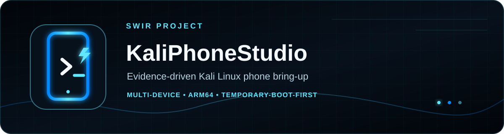

<!-- SWIR-README-STANDARD:v2 -->

<div align="center">



<br>


[](https://github.com/Swir/KaliPhoneStudio/actions/workflows/tests.yml)

**KaliPhoneStudio is a multi-device engineering studio for porting Kali Linux / NetHunter Pro as the primary phone OS/userspace, without Android as the user-facing layer.**

[**Highlights**](#highlights) · [**Quick Start**](#quick-start) · [**Compatibility**](#compatibility) · [**Roadmap**](#roadmap-and-releases) · [**Safety**](#safety-and-limitations)

</div>


## Project status

| Item | Status |
|---|---|
| Current development line | `0.6.60-dev` |
| Completion | **58%** |
| Current stage | Development / physical bring-up |
| First device profile | OnePlus Nord AC2003 — `oneplus/avicii` |
| Latest public release | **Not published yet** |
| Beta gate | **BLOCKED** |

**Current development line: `0.6.60-dev`**

**58% complete**

`███████████▋░░░░░░░░ 58%`

**Public Beta is not released.** The first supported profile, `oneplus/avicii` for the OnePlus Nord AC2003, is still in physical bring-up. Reviewed host-side rootfs, kernel and DTB/DTBO authorities exist, and rescue userspace now has a bounded read-only hardware-presence survey in addition to the physical evidence chain. Real-device identity, exact firmware/stock boot matching, temporary boot, accepted physical storage review, reversible rootfs staging, manually reviewed hardware evidence, Kali early-userspace, hardware safety and recovery gates are still pending.

KaliPhoneStudio is deliberately conservative: a profile, green CI, reproducible artifact, successful Fastboot return code, rescue marker, hardware-presence signal, storage-discovery record, manual-review record, cross-bound bring-up session or exact-file dossier does **not** by itself mean a phone is supported. The authoritative release rules live in [`BETA_RELEASE_GATE.md`](BETA_RELEASE_GATE.md).

## Overview

KaliPhoneStudio is designed to turn phone-specific Kali Linux / NetHunter Pro porting into a repeatable, evidence-driven workflow instead of a collection of one-off flashing scripts. The common Python core stays device-independent while hardware knowledge is isolated in validated device profiles.

The project currently focuses on building and proving a safe first-boot path for the OnePlus Nord AC2003 without Android as the user-facing OS layer. Permanent flashing is not the default workflow; temporary Fastboot boot and exact recovery evidence come first.

## Highlights

| Area | What KaliPhoneStudio provides |
|---|---|
| ⚡ Multi-device core | Device-independent runtime with profile-driven identity, boot, partition, source and recovery contracts. |
| 🔐 Fail-closed safety | Exact serial/profile/firmware/candidate binding before sensitive operations become eligible. |
| 🧬 Reproducible builds | Reviewed strict A/B authorities for Kali ARM64 rootfs, avicii kernel and DTB/DTBO artifacts. |
| 🛟 Rescue path | Deterministic source-locked ARM64 rescue initramfs with exact probe identity and remote access disabled by default. |
| 📦 Boot provenance | Exact OTA → payload → stock `boot.img` evidence plus deterministic boot-image assembly and round-trip checks. |
| 🧪 Physical evidence | Read-only rescue diagnostics, bounded manual functional probes, bounded sysfs-only hardware-presence survey, Kali early-userspace markers, typed storage discovery and one cross-bound audit session. |
| 🧾 Exact-file audit | A path-independent dossier verifies the exact session/evidence/transcript/report/recovery/review byte set before manual audit or later strategy design. |
| 💾 Storage safety | Discovery, review, session and dossier layers cannot choose a `/dev/...` target, mount storage or authorize a write. |
| 🖥️ Offline UI/CLI | Safe profile inspection without automatically invoking ADB/Fastboot or exposing unguarded write controls. |

The 0.6.60 hardware survey observes only bounded sysfs presence/state for USB, network/rfkill, sound, thermal, input, framebuffer/DRM and power supplies. It does not activate those subsystems, and every functional hardware verification flag remains false until separate physical review proves the capability.

## Compatibility

| Target | Current state |
|---|---|
| OnePlus Nord AC2003 (`oneplus/avicii`) | Bring-up; physical first boot pending |
| Other phones | Not supported until a validated profile and real hardware evidence are added |
| Persistent installation | **Not released** |
| Public Beta | **Blocked by the physical release gate** |

The avicii engineering baseline is pinned to LineageOS `android_device_oneplus_avicii@3f1270c2871e9893332073eb0f8f5f9499abbf13` and `android_kernel_oneplus_sm7250@fb4b4374d3b9ad0f10ba38d159585129f092fb3d` (`4.19.300`). These are source baselines, not claims that hardware support is complete.

## Reviewed host-side authorities

All records below are host-side evidence only and explicitly retain `hardware_verified=false` and `beta_gate_credit=false`.

| Layer | Authority run | Reviewed artifact |
|---|---:|---|
| Kali ARM64 rootfs | `35158577624` | SHA-256 `133d5d806e09917c5a3e23293f8e3ad9d8daadab9a8c8d9f6d507179b06ddb1d`, 137,460,600 B, 269 packages |
| avicii kernel | `35183670399` | ARM64 `Image` SHA-256 `be4440dc335d53c752270c484fe589a9bc1ef08f9100e885478b50df67cbe712`, 43,878,416 B |
| avicii DTB/DTBO | `35196447576` | DTB `48b0902a99c10a11ff52680bf81e9fec2574ad687c58ea35a00fdbf7aefe40ce`; packed DTBO `212392a25add2aa60fdc73163bfdbf1acc082bc5e6e1f3ff1c975e88b857b895` |

## Quick Start

### Requirements

- Python **3.11–3.14**
- Git
- packages from [`requirements.txt`](requirements.txt): PySide6 and PyYAML
- additional Linux build dependencies only for the specialized kernel/rootfs/DT workflows documented by their CI/build scripts

### Run from source

```bash
git clone https://github.com/Swir/KaliPhoneStudio.git
cd KaliPhoneStudio
python -m venv .venv
```

Activate the virtual environment, then install dependencies:

```bash
python -m pip install -r requirements.txt
```

Launch the offline studio:

```bash
python main.py
```

Useful non-destructive commands:

```bash
python main.py --list-profiles
python main.py --list-profiles --json
python main.py --profile-id oneplus/avicii --json
```

## Multi-device architecture

`Swir/KaliPhoneStudio` is the only source of truth for this project. Device-independent code belongs under `kaliphonestudio/`; device knowledge belongs under:

```text
devices/<vendor>/<codename>/profile.json
```

A profile does not equal hardware support. Before destructive actions can become eligible it must define unique identity, confirmation token, boot/partition constraints, pinned sources, recovery notes and host/hardware test contracts. The common core must not hardcode AC2003-specific facts when the same decision can be profile-driven.

## Rootfs handoff and physical storage evidence

The current storage pipeline intentionally stops before target selection.

1. `kaliphonestudio.rootfs_handoff` binds the exact physical candidate and reviewed rootfs authority to a source-pinned discovery contract.
2. `kaliphonestudio.physical_storage_discovery` binds real topology/filesystem/encryption/free-space observations plus recovery-plan bytes to the exact rescue/rootfs chain.
3. `kaliphonestudio.physical_storage_review` binds a human review record and review notes to that exact discovery evidence.
4. `kaliphonestudio.physical_bringup_session` cross-binds the candidate/rescue/storage chain into one immutable audit record and can optionally bind matching Kali early-userspace evidence.
5. `kaliphonestudio.physical_bringup_dossier` verifies the exact session file plus every bound evidence/raw capture file by SHA-256 and size, optionally including the full rootfs artifact.
6. Only a review-ready discovery with every required review check may become `accepted_for_strategy_design=true`.
7. Even then, `target_selected=false`, `storage_path_bound=false`, `write_authorized=false`, `handoff_ready=false`, `storage_verified=false`, `recovery_verified=false`, `hardware_verified=false` and `beta_gate_credit=false` remain mandatory.

For avicii, the exact pinned LineageOS `init/fstab.qcom` blob is `20873c3a84e1e6e8d2483e313f561ad35ded7355`. It describes userdata as F2FS with `fileencryption=ice` and `wrappedkey` on UFS with separate metadata encryption state. KaliPhoneStudio treats `userdata` only as a discovery role/hint, never as an approved rootfs target.

Create a safe-by-default review template only after real discovery evidence exists:

```bash
python scripts/prepare_physical_storage_review.py \
  --discovery-evidence evidence/physical-storage-discovery.json \
  --reviewer operator-1 \
  --out evidence/operator-storage-review.json
```

Then, after an actual manual review, bind its exact record and notes:

```bash
python scripts/review_physical_storage_discovery.py \
  --discovery-evidence evidence/physical-storage-discovery.json \
  --review-record evidence/operator-storage-review.json \
  --review-notes evidence/operator-storage-review-notes.txt \
  --out evidence/physical-storage-review.json
```

Once all exact candidate/rescue/discovery/review records exist, cross-bind them offline before any later target-strategy review:

```bash
python scripts/bind_physical_bringup_session.py \
  --candidate-gate evidence/physical-candidate-gate.json \
  --boot-observation evidence/physical-boot-observation.json \
  --rescue-diagnostics evidence/physical-rescue-diagnostics.json \
  --functional-probes evidence/physical-rescue-functional-probes.json \
  --storage-discovery evidence/physical-storage-discovery.json \
  --storage-review evidence/physical-storage-review.json \
  --out evidence/physical-bringup-session.json
```

Then build the exact-file dossier from that already-bound session and its original source bytes:

```bash
python scripts/build_physical_bringup_dossier.py \
  --session evidence/physical-bringup-session.json \
  --candidate-gate evidence/physical-candidate-gate.json \
  --boot-observation evidence/physical-boot-observation.json \
  --rescue-diagnostics evidence/physical-rescue-diagnostics.json \
  --functional-probes evidence/physical-rescue-functional-probes.json \
  --storage-discovery evidence/physical-storage-discovery.json \
  --storage-review evidence/physical-storage-review.json \
  --rescue-transcript evidence/rescue-transcript.log \
  --storage-discovery-report evidence/operator-storage-discovery.json \
  --recovery-plan evidence/recovery-plan.txt \
  --storage-review-record evidence/operator-storage-review.json \
  --storage-review-notes evidence/operator-storage-review-notes.txt \
  --out evidence/physical-bringup-dossier.json
```

These commands perform evidence handling only. They do not connect to a phone, mount storage, choose a partition or authorize a write. See [`docs/PHYSICAL_STORAGE_REVIEW.md`](docs/PHYSICAL_STORAGE_REVIEW.md), [`docs/PHYSICAL_BRINGUP_SESSION.md`](docs/PHYSICAL_BRINGUP_SESSION.md) and [`docs/PHYSICAL_BRINGUP_DOSSIER.md`](docs/PHYSICAL_BRINGUP_DOSSIER.md).

## Kali early-userspace proof

`kaliphonestudio.kali_early_userspace` builds a deterministic USTAR proof overlay bound to the exact first-boot manifest, reviewed authority bundle, rootfs-authority binding and strict rootfs artifact identity.

A systemd oneshot emits exact stage/probe/candidate/rootfs markers before `basic.target`. `kaliphonestudio.physical_kali_early_userspace` binds an operator-captured transcript to the same physical candidate and successful non-persistent temporary-boot execution. Marker matches remain observations requiring manual review; they do not automatically grant hardware/Beta credit.

See [`docs/KALI_EARLY_USERSPACE_PROOF.md`](docs/KALI_EARLY_USERSPACE_PROOF.md).

## Safety and limitations

- Prefer temporary `fastboot boot` over persistent writes.
- Never flash a physical phone without explicit user interaction and a verified exact-device baseline.
- Fail closed on identity, firmware, provenance, checksum, partition-layout or evidence drift.
- Keep host CI and physical hardware claims separate.
- Treat sysfs hardware presence as an observation only; it never proves the subsystem functions.
- Never weaken strict reproducibility to make a gate pass.
- Do not embed credentials or enable remote access by default.
- A storage role, layout hint, review-ready discovery, accepted manual review, valid bring-up session or exact-file dossier is **not** a block-device target.
- No public Beta or Stable release exists until the complete physical gate is reviewed.

## Development and verification

```bash
python -m compileall -q kaliphonestudio scripts tests
python -m pytest -q
```

Focused CI covers kernel/rootfs/DT reproducibility, rescue payloads/read-only diagnostics and hardware-presence policy, Kali early-userspace proof, source-locked rootfs handoff, typed physical-storage discovery, manual storage review, physical bring-up session cross-binding and exact-file dossier verification. Repository documentation and checked-in authority records are part of the safety contract and are CI-validated.

## Roadmap and releases

- Authoritative roadmap: [`ROADMAP.md`](ROADMAP.md)
- Beta release gate: [`BETA_RELEASE_GATE.md`](BETA_RELEASE_GATE.md)
- Active changes: [`CHANGELOG.md`](CHANGELOG.md)
- Machine-readable status: [`BUILD_STATUS.json`](BUILD_STATUS.json)

There is currently **no public Beta release**. The first Beta will only be published from an exact reviewed physical candidate with real assets, compatibility matrix, known issues, recovery instructions and SHA-256 checksums.

## 🔎 Search Keywords

`Kali Linux phone port` • `NetHunter Pro phone` • `Linux on smartphone` • `ARM64 Linux phone` • `OnePlus Nord AC2003 Linux` • `avicii Linux port` • `multi-device phone porting` • `Fastboot temporary boot` • `Android boot image tooling` • `DTB DTBO build` • `Kali ARM64 rootfs` • `phone rescue initramfs` • `phone hardware survey` • `reproducible kernel build` • `UFS storage discovery` • `safe phone flashing workflow`


<div align="center">

### `BUILD • VERIFY • BOOT • RECOVER`

⭐ **If KaliPhoneStudio is useful, consider leaving a star.**

[**← SWIR profile**](https://github.com/Swir) · [**All projects →**](https://github.com/Swir?tab=repositories)

</div>