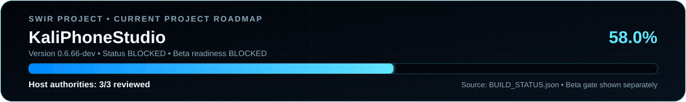

<!-- SWIR-README-STANDARD:v2 -->
<div align="center">
  
</div>

<div align="center">
  
  
  
  
  
</div>

<p align="center">
  <strong>Profile-driven tooling for bringing Kali Linux / NetHunter Pro toward bare-metal phone targets without Android as the user-space layer.</strong><br>
  Reproducible host builds, exact evidence chains, recovery-first safety and real-device gates before any support claim.
</p>

<p align="center">
  <a href="#project-status">Status</a> •
  <a href="#highlights">Highlights</a> •
  <a href="#quick-start">Quick Start</a> •
  <a href="#compatibility">Compatibility</a> •
  <a href="#multi-device-architecture">Architecture</a> •
  <a href="#physical-bring-up-flow">Bring-up</a> •
  <a href="#roadmap-and-releases">Roadmap</a> •
  <a href="#safety-and-limitations">Safety</a>
</p>

<div align="center">
  
</div>

## Project status

Current development line: `0.6.66-dev`

**58% complete**

<div align="center">
  
</div>

**Roadmap progress:** **58.0%** — **BLOCKED** · **Host authorities: 3/3 reviewed** · Beta readiness: **BLOCKED**.

The progress SVG is generated deterministically from [`BUILD_STATUS.json`](BUILD_STATUS.json). Its fill width is computed from the authoritative reviewed `project_progress_percent` value (`track_width × percentage / 100`). Raw roadmap checkboxes are **not** treated as equal-weight work. Beta readiness is displayed separately and remains blocked until the complete physical gate is reviewed.

| Area | Current verified state |
|---|---|
| Multi-device host core | Implemented and covered by CI |
| Device-profile contract | Schema v3 + Draft 2020-12 structural schema + runtime semantic validation |
| Typed identity safety | Strong product/model signals; weak board context cannot identify a device by itself |
| Kali ARM64 rootfs authority | `passed-reviewed` |
| Kernel authority | `passed-reviewed` |
| DTB/DTBO authority | `passed-reviewed` |
| Deterministic rescue payload | Host-side reproducibility path implemented |
| First device profile | `oneplus/avicii` / OnePlus Nord AC2003 |
| Physical AC2003 verification | **Not completed** |
| Public Beta | **BLOCKED** |

`58%` is the project's reviewed roadmap ledger value, not an estimate of remaining calendar time and not a Beta-readiness percentage. See [`BUILD_STATUS.json`](BUILD_STATUS.json), [`ROADMAP.md`](ROADMAP.md) and [`BETA_RELEASE_GATE.md`](BETA_RELEASE_GATE.md) for the authoritative detail.

## Highlights

- **Profile-driven multi-device core** — phone-specific identity, boot constraints, sources, recovery notes and test contracts live under `devices/<vendor>/<codename>/profile.json` instead of global AC2003 hard-coding.
- **Formal profile schema v3** — `devices/profile.schema.json` provides Draft 2020-12 structural validation while the runtime validator enforces cross-field safety semantics.
- **Strong/weak identity model** — product/model identifiers can be strong; shared board identifiers can be weak context and are forbidden from identifying a phone by themselves.
- **Registry-wide identity audit** — every strong value must resolve exactly one profile; shared weak values remain allowed only while weak-only resolution fails closed, including through the frozen Windows CLI.
- **Reviewed reproducibility authorities** — exact Kali ARM64 rootfs, kernel and DTB/DTBO build authorities are recorded separately from physical-device claims.
- **Recovery-first temporary boot** — the host path prefers non-persistent `fastboot boot`, exact serial/profile/firmware/candidate binding and explicit confirmation rather than silent flashing.
- **Deterministic rescue userspace** — reproducible rescue ramdisk, exact probe identity, bounded read-only diagnostics and evidence binding.
- **Exact physical evidence chain** — rescue observations, storage discovery/review, bring-up sessions and dossiers fail closed when identities, transcripts or source files drift.
- **Independent physical test-plan review** — the original canonical functional-test plan must be reviewed before any real per-test observation may be recorded.
- **Schema-v2 functional observations** — every physical test observation cryptographically carries the accepted exact plan-review identity and cannot promote hardware or Beta state by itself.
- **Exact functional-result bundle** — the exact plan, accepted plan review, schema-v2 observations, independent result reviews and freshly recomputed summary are frozen into one canonical audit artifact before release-gate review.
- **Cross-campaign release-gate audit** — the accepted bring-up dossier/review and exact functional-result bundle must resolve to the same profile, serial, boot observation, rescue diagnostics, transcript and probe before they can be presented together for manual gate review.
- **Fail-closed logical target binding** — after an accepted reversible rootfs strategy review, KaliPhoneStudio can bind the exact logical partition role/kernel/filesystem/unlock/free-space/staging identity from the original reviewed storage report while deliberately carrying no raw `/dev` path, mount target, trial execution or write authorization.
- **Source locking** — host builds bind exact upstream commits, tool versions and relevant source/blob identities instead of floating branches.
- **SWIR Progress SVG PRO** — deterministic card/mini assets derive geometry from the same authoritative status source while showing project progress and Beta readiness separately.

## Quick Start

### Requirements

- Python **3.11–3.14** for the host-side tooling and tests.
- Git for source-lock and reproducibility workflows.
- Android platform tools / Fastboot only for workflows that explicitly need physical-device interaction.
- Linux is the primary environment for kernel/rootfs/device-tree build work; the application core remains Python-based and Windows-host workflows are a project target.

### Clone and run host tests

```bash
git clone https://github.com/Swir/KaliPhoneStudio.git
cd KaliPhoneStudio
python -m pip install -r requirements.txt
python -m pip install pytest
python -m pytest -q
python -m compileall -q kaliphonestudio scripts
```

### Validate device profiles

```bash
python -m pip install -r build/profile-schema-requirements.txt
python scripts/validate_device_profiles_jsonschema.py
python -m kaliphonestudio.profile_registry_audit --devices-root devices --json
```

The first command set validates the formal Draft 2020-12 schema and runtime semantic contract. The registry audit then verifies the complete typed identity namespace, including unique strong signals and non-identifying weak signals.

### Verify the deterministic progress presentation

```bash
python scripts/generate_progress_svgs.py --check
```

The generator verifies the committed card, mini and reusable N/A template against `BUILD_STATUS.json`, checks XML/bounded geometry and confirms the README/ROADMAP textual fallback matches the same source.

### Launch the current host application

```bash
python main.py
```

The host application is **not** a claim that Kali already boots as a daily-driver OS on AC2003. Hardware support remains gated by real-device evidence.

## Compatibility

| Device / profile | Host tooling | Physical bare-metal Kali status | Beta status |
|---|---|---|---|
| OnePlus Nord AC2003 (`oneplus/avicii`) | First profile implemented | **Unverified on the required physical gate** | **BLOCKED** |
| Other devices | Profile architecture prepared | Not supported until a complete profile + test contract + physical validation exists | Not available |

Adding a profile JSON does **not** automatically create hardware support. A device becomes a supported target only after its exact firmware/boot/storage/recovery and required hardware behavior have been validated under the release gate.

## Multi-device architecture

```text
KaliPhoneStudio/
├── kaliphonestudio/                 # device-independent host core where practical
├── devices/
│   ├── profile.schema.json           # structural profile schema v3 contract
│   └── oneplus/
│       └── avicii/
│           └── profile.json         # AC2003 identity + device-specific constraints/contracts
├── rescue/                          # deterministic rescue userspace input
├── evidence/                        # reviewed immutable authority records
├── scripts/                         # reproducibility, evidence and operator CLIs
├── tests/                           # fail-closed contracts and regression coverage
└── .github/workflows/               # CI / reproducibility / focused safety workflows
```

Global device detection and destructive-action policy should remain profile-driven. Device-specific assumptions belong in the selected profile or its related device documentation/modules, not scattered through the core. See [`docs/MULTI_DEVICE_PROFILE_REGISTRY.md`](docs/MULTI_DEVICE_PROFILE_REGISTRY.md) for the schema-v3 and strong/weak identity contract.

## Physical bring-up flow

The host-side chain is intentionally stricter than a normal flashing utility:

```text
real phone identity + exact firmware baseline
                ↓
matching stock boot.img / OTA provenance
                ↓
reviewed physical candidate
                ↓
non-persistent temporary boot + rescue transcript
                ↓
bounded hardware/storage discovery
                ↓
manual contextual review
                ↓
exact profile-driven functional-test plan
                ↓
independent exact-plan review
                ↓
schema-v2 physical observations + independent result review
                ↓
exact-file functional result bundle
                ↓
exact bring-up dossier/review ↔ functional campaign cross-audit
                ↓
manual release-gate review + reversible rootfs handoff strategy review
                ↓
exact logical target-binding review (no raw path / mount / write)
                ↓
fresh-device revalidation + separately gated manual trial
                ↓
Kali early-userspace proof + subsystem validation
                ↓
full Beta release-gate review
```

The exact plan review is an enforced boundary. Preparing an observation template requires both the plan and its accepted review evidence:

```bash
python scripts/prepare_physical_hardware_test_observation.py \
  --test-plan evidence/physical-hardware-test-plan.json \
  --test-plan-review-evidence evidence/physical-hardware-test-plan-review-evidence.json \
  --test-id display \
  --operator operator-1 \
  --out evidence/display-observation-record.json
```

The template still starts as not executed and inconclusive. It must be edited only after the exact test is physically performed. The resulting schema-v2 evidence remains manual-review-only and cannot authorize a persistent write, support claim or Beta release.

After independent per-test reviews, the exact files can be cross-bound into the non-promoting result bundle:

```bash
python scripts/build_physical_hardware_result_bundle.py \
  --test-plan evidence/physical-hardware-test-plan.json \
  --test-plan-review-evidence evidence/physical-hardware-test-plan-review-evidence.json \
  --observation-evidence evidence/display-observation-evidence.json \
  --review-evidence evidence/display-review-evidence.json \
  --summary-evidence evidence/physical-hardware-test-summary.json \
  --out evidence/physical-hardware-result-bundle.json
```

Before a dossier and functional campaign can be presented together for manual release-gate review, freeze their shared physical context into the cross-campaign audit packet:

```bash
python scripts/build_physical_release_gate_audit.py \
  --dossier evidence/physical/dossier.json \
  --dossier-verification evidence/physical/dossier-verification.json \
  --dossier-review evidence/physical/dossier-review.json \
  --functional-result-bundle evidence/physical/functional-result-bundle.json \
  --test-plan evidence/physical/functional-test-plan.json \
  --test-plan-review evidence/physical/functional-test-plan-review.json \
  --out evidence/physical/release-gate-audit.json
```

Even a bundle in which every Beta-required functional test is a reviewed pass, and even a successfully cross-bound audit packet, remain only release-gate input; `hardware_verified`, `beta_release_authorized` and `beta_gate_credit` remain false until the complete physical gate is reviewed.

Detailed operator contracts live in:

- [`docs/MULTI_DEVICE_PROFILE_REGISTRY.md`](docs/MULTI_DEVICE_PROFILE_REGISTRY.md)
- [`docs/FASTBOOT_BASELINE.md`](docs/FASTBOOT_BASELINE.md)
- [`docs/RESCUE_PHYSICAL_PROOF.md`](docs/RESCUE_PHYSICAL_PROOF.md)
- [`docs/PHYSICAL_HARDWARE_SURVEY_REVIEW.md`](docs/PHYSICAL_HARDWARE_SURVEY_REVIEW.md)
- [`docs/PHYSICAL_HARDWARE_TEST_PLAN_REVIEW.md`](docs/PHYSICAL_HARDWARE_TEST_PLAN_REVIEW.md)
- [`docs/PHYSICAL_HARDWARE_FUNCTIONAL_TESTS.md`](docs/PHYSICAL_HARDWARE_FUNCTIONAL_TESTS.md)
- [`docs/PHYSICAL_HARDWARE_RESULT_BUNDLE.md`](docs/PHYSICAL_HARDWARE_RESULT_BUNDLE.md)
- [`docs/PHYSICAL_STORAGE_REVIEW.md`](docs/PHYSICAL_STORAGE_REVIEW.md)
- [`docs/PHYSICAL_BRINGUP_SESSION.md`](docs/PHYSICAL_BRINGUP_SESSION.md)
- [`docs/PHYSICAL_BRINGUP_DOSSIER.md`](docs/PHYSICAL_BRINGUP_DOSSIER.md)
- [`docs/PHYSICAL_RELEASE_GATE_AUDIT.md`](docs/PHYSICAL_RELEASE_GATE_AUDIT.md)
- [`docs/ROOTFS_HANDOFF_STRATEGY_REVIEW.md`](docs/ROOTFS_HANDOFF_STRATEGY_REVIEW.md)
- [`docs/ROOTFS_HANDOFF_TARGET_BINDING.md`](docs/ROOTFS_HANDOFF_TARGET_BINDING.md)
- [`docs/KALI_EARLY_USERSPACE_PROOF.md`](docs/KALI_EARLY_USERSPACE_PROOF.md)

## Build and reproducibility model

KaliPhoneStudio separates three different facts that must never be conflated:

1. **Host build reproducibility** — two reviewed builds can be byte-identical under pinned sources/tools.
2. **Candidate/evidence integrity** — exact hashes, identities and review records can be cross-bound and audited.
3. **Physical hardware support** — the exact phone actually boots and the required subsystems behave safely.

The first two can be established offline. The third requires a real device and is the reason the Beta gate remains blocked.

Reviewed host authorities currently tracked in `BUILD_STATUS.json`:

- Kali ARM64 rootfs: `passed-reviewed`
- kernel: `passed-reviewed`
- device tree: `passed-reviewed`

These authority records intentionally keep `hardware_verified=false` and `beta_gate_credit=false`.

## Roadmap and releases

The detailed roadmap is in [`ROADMAP.md`](ROADMAP.md). The release checklist is [`BETA_RELEASE_GATE.md`](BETA_RELEASE_GATE.md).

A first GitHub Beta will be created only after the complete mandatory physical AC2003 gate has been reviewed. A green CI run, a reproducible host build, an SVG progress card, a successful Fastboot process return code, a rescue marker, a synthetic evidence record, a complete host-side functional result bundle, a cross-campaign audit packet or a logical target-binding review is not enough.

The first Beta must include real candidate binaries/images, exact commit identity, installation/test instructions, compatibility matrix, known issues and SHA-256 checksums. Stable will require a later, higher threshold.

## Safety and limitations

> **KaliPhoneStudio is development tooling for controlled bring-up, not a one-click production flasher.**

- Never treat profile presence or CI success as proof that hardware works.
- Do not permanently flash a physical phone without explicit, informed user interaction.
- Prefer a non-persistent temporary boot and recovery-first validation.
- Keep firmware, stock `boot.img`, candidate, serial and profile identities tied together.
- Never guess a UFS/block-device path from a host-side layout hint.
- A logical target-binding review is evidence only: it must not be translated into a raw `/dev` path, mount or write until a later fresh-device/manual execution gate revalidates the exact phone and context.
- Do not promote bounded sysfs presence, a 4 KiB read, battery telemetry, a host-side result bundle or an audit packet into a functional-hardware claim.
- Keep project progress distinct from release readiness; `58%` does not mean Beta is 58% ready.
- Real recovery/rollback must be exercised before public Beta publication.

## Contributing

Contributions should preserve the fail-closed, profile-driven architecture:

- keep generic behavior in `kaliphonestudio/` where practical;
- put hardware-specific facts in the appropriate device profile/module/docs;
- pin upstream source identities used by build or safety decisions;
- declare strong/weak identity signals explicitly and never promote a shared weak board value into sufficient device identity;
- add tests for every new safety/evidence contract;
- do not mark a subsystem as working without real physical evidence;
- update status/roadmap/changelog only for verified milestones.

## 🔎 Search Keywords

`KaliPhoneStudio` `Kali Linux phone` `Linux on phone` `bare metal Linux phone` `NetHunter Pro porting` `supported device porting` `OnePlus Nord AC2003` `avicii Linux` `ARM64 rootfs` `Android boot image` `fastboot boot` `phone recovery` `DTB DTBO` `initramfs rescue` `UFS storage` `reproducible builds` `device profile schema` `multi-device phone porting` `mobile Linux bring-up`

---

<div align="center">
  <sub><strong>KaliPhoneStudio</strong> • built under the SWIR project family • <a href="https://github.com/Swir">github.com/Swir</a></sub><br>
  <sub>Safety-first evidence, reproducible builds, truthful hardware status.</sub>
</div>